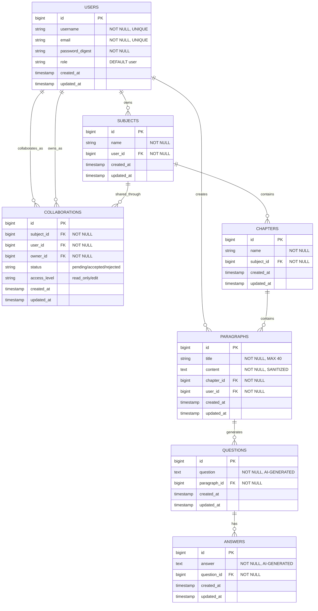

# InfoVault - Entity Relationship Diagram

## Visual ERD (Mermaid Diagram)



## Hierarchical Structure

```
User (Owner)
    └── Subject
        ├── Chapter 1
        │   ├── Paragraph 1 (created by User)
        │   │   ├── Question 1
        │   │   │   └── Answer 1
        │   │   ├── Question 2
        │   │   │   └── Answer 2
        │   │   └── Question N (AI-generated, max 5 per paragraph)
        │   │       └── Answer N
        │   └── Paragraph N
        └── Chapter N

Collaboration Flow:
Owner (User) --> Collaboration --> Collaborator (User)
                      ↓
                   Subject (shared)
```

## Relationship Details

### 1. **User → Subject** (One-to-Many, Owner)
- **Type:** One User can own many Subjects
- **FK:** `subjects.user_id` → `users.id`
- **Cascade:** `dependent: :destroy` (deleting user deletes their subjects)
- **Validation:** Subject must have a user

### 2. **Subject → Chapter** (One-to-Many)
- **Type:** One Subject can have many Chapters
- **FK:** `chapters.subject_id` → `subjects.id`
- **Cascade:** `dependent: :destroy`
- **Validation:** Chapter must belong to a subject

### 3. **Chapter → Paragraph** (One-to-Many)
- **Type:** One Chapter can have many Paragraphs
- **FK:** `paragraphs.chapter_id` → `chapters.id`
- **Cascade:** `dependent: :destroy`
- **Validation:** Paragraph must belong to a chapter

### 4. **User → Paragraph** (One-to-Many, Author)
- **Type:** One User can create many Paragraphs
- **FK:** `paragraphs.user_id` → `users.id`
- **Cascade:** `dependent: :destroy`
- **Validation:** Paragraph must have a user (author)
- **Note:** This tracks who created the paragraph (can be owner or collaborator)

### 5. **Paragraph → Question** (One-to-Many)
- **Type:** One Paragraph can have many Questions (AI-generated)
- **FK:** `questions.paragraph_id` → `paragraphs.id`
- **Cascade:** `dependent: :destroy`
- **Validation:** Question must belong to a paragraph
- **Business Logic:** Typically 5 questions generated per paragraph

### 6. **Question → Answer** (One-to-Many)
- **Type:** One Question can have many Answers
- **FK:** `answers.question_id` → `questions.id`
- **Cascade:** `dependent: :destroy`
- **Validation:** Answer must belong to a question
- **Note:** Currently 1:1 relationship but designed for potential multiple answers

### 7. **User ↔ Subject** (Many-to-Many via Collaborations)
- **Type:** Many Users can collaborate on many Subjects
- **Join Table:** `collaborations`
- **FKs:** 
  - `collaborations.user_id` → `users.id` (collaborator)
  - `collaborations.subject_id` → `subjects.id`
  - `collaborations.owner_id` → `users.id` (subject owner)
- **Cascade:** `dependent: :destroy`
- **Attributes:**
  - `status`: pending, accepted, rejected
  - `access_level`: read_only, edit
- **Validation:** All foreign keys and status/access_level must be valid

### 8. **User → Question** (Indirect via Paragraph)
- **Type:** User has_many questions through paragraphs
- **Path:** User → Paragraphs → Questions
- **Purpose:** Allows querying all questions from a user's paragraphs

## Foreign Key Constraints

```sql
add_foreign_key "answers", "questions"
add_foreign_key "chapters", "subjects"
add_foreign_key "collaborations", "subjects"
add_foreign_key "collaborations", "users"
add_foreign_key "paragraphs", "chapters"
add_foreign_key "paragraphs", "users"
add_foreign_key "questions", "paragraphs"
add_foreign_key "subjects", "users"
```

## Indexes

All foreign key columns have indexes for optimal query performance:
- `index_answers_on_question_id`
- `index_chapters_on_subject_id`
- `index_collaborations_on_subject_id`
- `index_collaborations_on_user_id`
- `index_paragraphs_on_chapter_id`
- `index_paragraphs_on_user_id`
- `index_questions_on_paragraph_id`
- `index_subjects_on_user_id`

## Cascade Delete Behavior

```
User (deleted)
  └── Cascades to:
      ├── Subjects (all owned subjects)
      ├── Paragraphs (all created paragraphs)
      └── Collaborations (all collaborations as user or owner)

Subject (deleted)
  └── Cascades to:
      ├── Chapters (all chapters)
      └── Collaborations (all collaboration invites)

Chapter (deleted)
  └── Cascades to:
      └── Paragraphs (all paragraphs)

Paragraph (deleted)
  └── Cascades to:
      └── Questions (all questions)

Question (deleted)
  └── Cascades to:
      └── Answers (all answers)
```

## Special Relationships

### Collaboration Model
The `Collaboration` model is unique as it has **two relationships to the User table**:
1. **user_id**: The collaborator being invited
2. **owner_id**: The subject owner sending the invitation

This allows tracking who invited whom and managing permissions effectively.

### Content Hierarchy Flow
```
User creates → Subject
Subject organizes → Chapters
Chapters contain → Paragraphs
Paragraphs trigger → AI Question Generation
Questions paired with → AI Answers
```

### Access Control Flow
```
Owner (User) creates → Subject
Owner sends → Collaboration Invite
Collaborator receives → Status: pending
Collaborator accepts → Status: accepted
Collaborator gains → Access Level (read_only/edit)
Collaborator can now → View/Edit Subject content (based on access_level)
```

## Data Integrity Rules

1. **Username & Email Uniqueness**: Enforced at database and model level
2. **Password Security**: Minimum 5 characters, bcrypt hashing
3. **Content Sanitization**: Paragraph content sanitized before save
4. **Status Validation**: Only pending/accepted/rejected allowed
5. **Access Level Validation**: Only read_only/edit allowed
6. **Not Null Constraints**: All foreign keys and critical fields are NOT NULL

## Query Optimization

All foreign keys are indexed, enabling efficient queries like:
- Finding all subjects for a user
- Finding all chapters in a subject
- Finding all paragraphs in a chapter
- Finding all questions for a paragraph
- Finding all collaborators for a subject
- Finding all collaborated subjects for a user

